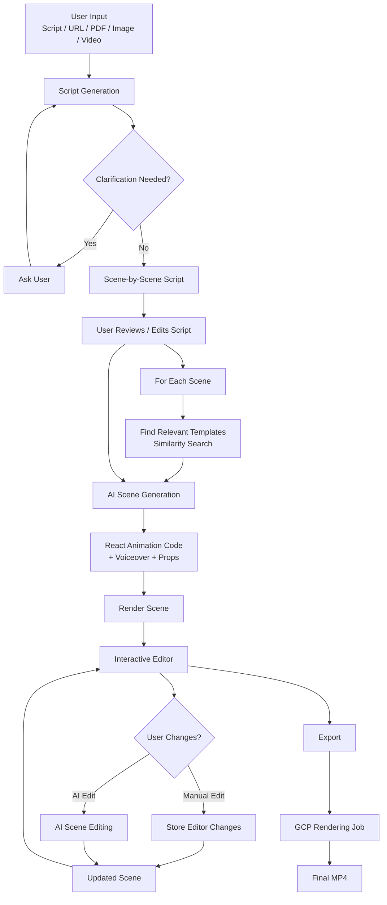
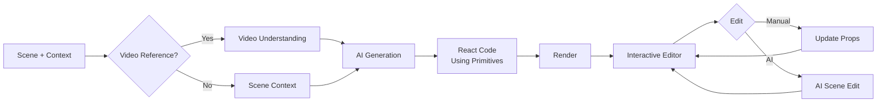
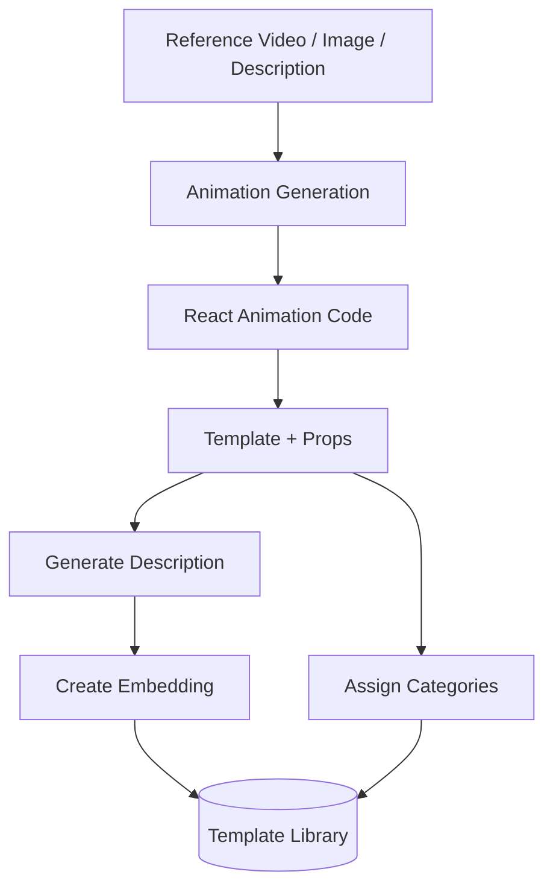

# Dart.video

**Dart.video is an open-source AI-powered motion graphics generator.**

It turns an idea, script, webpage, PDF, image, or video reference into an editable motion graphics video.

Instead of generating an entire video in one shot, Dart generates it **scene by scene** using reusable templates and a set of predefined animation primitives. This makes generation faster, cheaper, more deterministic, and—most importantly—the output remains easy to edit.

## Why Dart?

Most AI video generation approaches treat the video as one large generation problem.

Dart takes a different approach:

> **Generate the right structure first, then generate and edit individual scenes.**

This gives us:

* **Fast first draft** — target < 1 minute
* **Low generation cost** — target < $0.50 for the first draft
* **Deterministic output** — common UI/animation patterns come from reusable primitives and templates
* **Scene-level editing** — change one part without regenerating the entire video
* **AI + manual editing** — users can modify the animation directly or ask AI to make changes
* **Reusable templates** — solve the blank-slate problem and reduce generation cost
* **Brand-aware output** — colors, logos, icons and themes can be changed without regenerating the animation

---

# 🏗️ Architecture

The overall pipeline looks like this:



The important architectural idea is that **the scene is the unit of generation and editing**.

A video is essentially:

```text
Video
 ├── Scene 1
 ├── Scene 2
 ├── Scene 3
 └── Scene N
```

Each scene has its own animation, props, assets and voiceover.

This allows Dart to regenerate or modify only the part of the video that needs to change.

---

# 🎬 End-to-End Flow

### 1. User provides an input

The input can be:

* A script
* A URL
* A PDF
* An image
* A video reference
* A description of what they want to create

### 2. Generate the script

AI converts the input into a structured script.

If more information is needed, the AI can ask questions using the `ask_question` tool and continue the conversation until it has enough context.

The resulting script is broken down into individual scenes.

### 3. User reviews the script

The user can edit, remove, reorder or approve scenes before animation generation starts.

### 4. Find templates for each scene

For every scene, Dart searches the template library using similarity search.

Relevant templates are provided to the AI together with the original scene/script.

This gives the AI a starting point instead of asking it to invent every animation from scratch.

### 5. Generate the animation

AI generates React code using Dart's predefined animation primitives.

The result includes:

* Animation
* Props
* Assets
* Voiceover
* Scene configuration

### 6. Edit in the interactive editor

The generated animation is immediately rendered in the editor.

Users can:

* Change text
* Change colors
* Replace images
* Replace logos
* Move elements
* Adjust animation properties
* Add/remove scenes
* Reorder scenes
* Ask AI to modify the scene

Manual edits are preserved and sent back to AI when further AI edits are requested.

### 7. Export

Once the video is ready, Dart triggers a GCP rendering job that combines the scenes into the final MP4.

---

# 🎞️ Animation Generation

Animations are **always generated scene by scene**.

A simplified generation flow:



If the input contains a video reference, the video is first routed to a vision/video understanding model.

The AI then generates React code using a predefined set of primitives.

If clarification is required, the AI can ask the user questions during generation.

---

# 🧱 Custom Animation Primitives

Dart does not ask AI to generate everything from scratch.

Instead, it provides a set of reusable primitives such as:

```text
Text
Image
Video
Logo
Icon
Shape
Container
...
```

These primitives are:

* **Theme aware**
* **Brand aware**
* **Editable**
* **Reusable**
* **More deterministic than generating raw code every time**

For example, AI doesn't need to figure out how to implement a logo component or decide what brand color to use.

It can simply compose:

```text
Logo + Text + Image + Container
```

with the appropriate props.

### Why this matters

This approach gives us several benefits:

**Less hallucination**

AI doesn't need to recreate common UI and animation code every time.

**Better editing**

Because the output is built from known primitives, the editor knows how to modify each element.

**Brand consistency**

Colors and styles come from the theme instead of being randomly generated by the model.

**Faster generation**

The model generates a smaller amount of structured code.

**More deterministic output**

The same primitives can produce predictable results across generations.

---

# 🎨 Themes & Branding

Brand information is treated as part of the rendering system rather than something the AI needs to guess.

A user can change:

* Primary colors
* Secondary colors
* Backgrounds
* Logos
* Icons
* Typography
* Theme

without regenerating the animation.

For example:

```text
Generated Scene
       │
       ▼
┌─────────────────┐
│ Theme            │
│ ├─ Colors        │
│ ├─ Logo          │
│ ├─ Typography    │
│ └─ Background    │
└─────────────────┘
       │
       ▼
Rendered Animation
```

This keeps the generated animation independent from the brand styling.

---

# 📚 Templates

Templates are used to solve the **blank-slate problem**.

Instead of asking AI:

> "Create any animation for this scene."

Dart can provide relevant examples:

> "Here are some animations that work well for this type of scene. Adapt one of them."

### Template generation

A template can be created from:

* A reference video
* A reference image
* A text description

The same animation generation pipeline is used to create the initial animation.

The generated React code and its props are then stored as a template.



Each template contains:

* Animation code
* Props
* Description
* Categories
* Embeddings

The description is converted into an embedding and used for similarity search.

When generating a new scene, Dart searches for semantically similar templates and provides the most relevant ones to the AI.

---

# 🔄 Scene-Level Generation

Scene-level generation is a deliberate design choice.

### 1. Easier editing

Users can focus on one part of the video instead of regenerating the entire video.

### 2. Faster generation

Each AI request has a smaller context and a narrower scope.

### 3. Cheaper

Only the scene that needs to change needs to be regenerated.

### 4. More deterministic

The AI has fewer things to reason about at once.

### 5. Better prompting

It is much easier to tell AI:

> "Change this scene to show a dashboard appearing."

than:

> "Change something around the 45-second mark of this 2-minute video."

---

# ✨ Features

* AI script generation
* Scene-by-scene animation generation
* Reusable animation templates
* Similarity search for templates
* Custom animation primitives
* Interactive visual editor
* AI-powered scene editing
* Manual drag-and-drop editing
* Brand/theme support
* Dynamic colors
* Logo and icon replacement
* Image/video references
* Zoom and camera movements
* Scene transitions
* Background customization
* Animation suggestions from predefined templates
* Scene reordering
* Final MP4 rendering

---

# 🖼️ Media

Dart currently uses:

* **Tabler Icons** for icons
* **TheSVG** for brand logos
* **Google Cloud Storage** for user-uploaded media

> Uploaded media is currently stored in a public GCP bucket. This should eventually be replaced with signed URLs.

---

# 🧰 Tech Stack

### Backend

* Go `1.23+`
* PostgreSQL
* Redis
* Docker

### Frontend

* Node.js `20+`
* PNPM
* Next.js / React
* Tailwind CSS
* Material UI

### Authentication & APIs

* Auth0
* Passwordless authentication

### Rendering

* React-based scene rendering
* GCP jobs for final video rendering

---

# ⚙️ Getting Started

## Prerequisites

Make sure you have:

* Docker
* Go `1.23+`
* Node.js `20+`
* PNPM
* [direnv](https://direnv.net/)

## Configuration

Start local PostgreSQL, Redis and the Pub/Sub emulator:

```bash
./devel/up.sh
```

Copy the environment file:

```bash
cp .envrc.example .envrc
direnv allow
```

Replace the `<value>` placeholders with your actual secrets and configuration.

## Initialize the database

```bash
./backend/script/migrate.sh up
```

## Backend

Build and start the backend:

```bash
cd backend/cmd/coasterai
go build -o coasterai && ./coasterai start
```

Run tests:

```bash
go test ./...
```

Create a new migration:

```bash
./backend/script/migrate.sh new <migration_name>
```

For development, [reflex](https://github.com/cespare/reflex) can be used for live reload:

```bash
reflex -c .reflex
```

## Frontend

Install dependencies:

```bash
cd frontend
pnpm install
```

Start the development server:

```bash
pnpm dev:portal
```

Open:

```text
http://localhost:3000
```

---

# 🚀 Running the Project

You need three components running locally:

### 1. Infrastructure

PostgreSQL, Redis and Pub/Sub emulator:

```bash
./devel/up.sh
```

### 2. Backend

```bash
reflex -c .reflex
```

### 3. Frontend

```bash
cd frontend
pnpm dev:portal
```

---

# 🛠️ Admin Interface

There is no separate admin application.

Users with the `PLATFORM_ADMIN` role can:

* View all organizations
* Access all accounts
* Manage platform-level data

---

# 🎯 Project Goals

Dart is built around a simple goal:

> **Go from an idea to an editable video draft as quickly and cheaply as possible.**

The long-term direction is to make the generation process as deterministic as possible by combining:

1. **Reusable templates** for common animation patterns
2. **Custom primitives** for predictable output
3. **On-demand scene generation** for new or unique animations
4. **An interactive editor** for precise manual changes
5. **AI-assisted editing** for higher-level changes

The goal isn't to have AI generate a perfect video in one shot.

The goal is to make it extremely fast to get to a good first draft—and then make that draft easy to refine.
